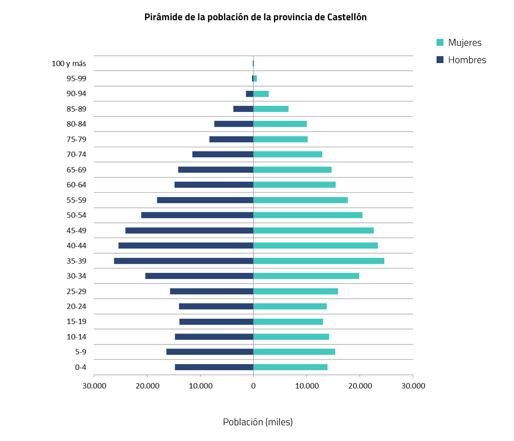
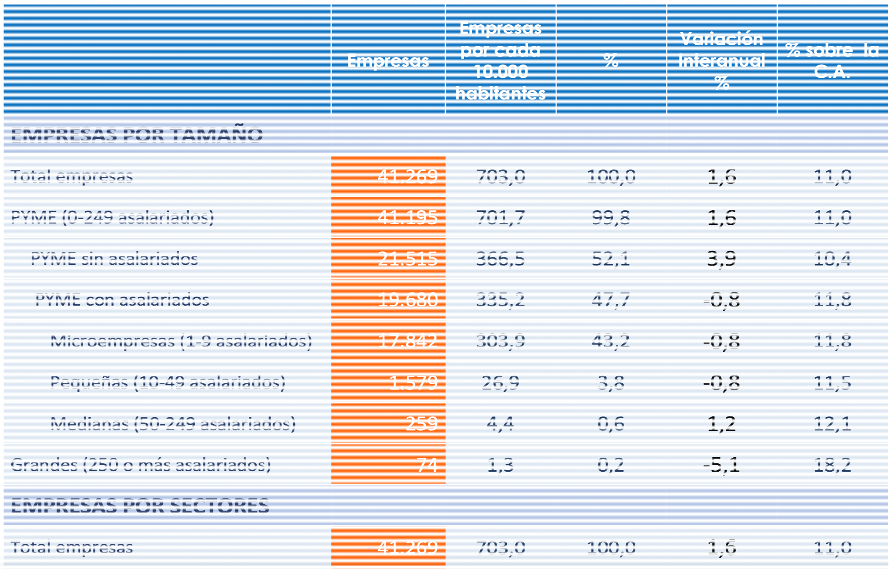

## 1. Introducció

### Referencia legal

- [Llei Orgànica 3/2022, de 31 de març](https://www.boe.es/eli/es/lo/2022/03/31/3/con){:target="_blank"}, d'**ordenació i integració** de la Formació Professional.
- [**Reial decret 659/2023, de 18 de juliol**](https://www.boe.es/eli/es/rd/2023/07/18/659/con){:target="_blank"}, pel qual es **desenvolupa l'ordenació** del Sistema de Formació Professional
- [Reial decret 278/2023, d'11 d'abril](https://www.boe.es/eli/es/rd/2023/04/11/278/con){:target="_blank"}, pel qual s'estableix el **calendari d'implantació** del Sistema de Formació Professional
- [Reial decret 1147/2011, de 29 de juliol](https://www.boe.es/buscar/act.php?id=BOE-A-2011-13118){:target="_blank"}, pel qual s'estableix l'ordenació general de la formació professional del sistema educatiu
- Reial decret  499/2024, de 21 de mayo,  pel qual es modifica el Real Decreto 1631/2009, de 30 d'octubre, pel qual s'establix el títol de Tècnic en Gestió Administrativa i es fixen els seus ensenyaments mínims.
- Orde 37/2012, de 22 juny de la Conselleria d'Educació, Formació i Ocupació, per la qual s'establix per a la Comunitat Valenciana el currículum del cicle formativo de grau mig corresponent al títol de Tècnic en Gestió Administrativa.
- Orde 79/2010, de 27 d'agost, de la Conselleria d'Educació, per la qual es re-gola l'avaluació de l'alumnat dels cicles formatius de Formació Profesional del sistema educatiu en l'àmbit territorial de la Comunitat Valenciana.
- RESOLUCIÓ de 5 de juny de 2024, del director general de Centres Docents, per la que es fixa el calendari escolar del curs acadèmic 2024-2025 en la Comunitat Valenciana.
- Orde 20/2019, de 30 d'abril, de la Conselleria de Cultura, Educació i Esport, per la qual es regula l'organització de la resposta educativa per a la inclusió de l'alumnat en els centres docents sostinguts amb fons públics del sistema educatiu valencià.

### Contextualització 

#### Análisis del entorno socioeconómico

##### Demografía

###### Población total y segmentación demográfica (edad, género, nivel educativo)

La población de la provincia de Castellón es de 603.952 habitantes, y la capital, Castelló de la Plana, tiene una población de 176.238 habitantes. 

La edad está representada según la siguiente tabla de población:

!!!! FALTA TABLA
 
**Estimaciones de la población de la provincia de Castellón**

I. Cifras oficiales de la población resultantes de la revisión del Padrón municipal a 1 de enero de 2023*      

Unidades: Personas

Castellón

|Ambos sexos|Hombres|Mujeres|
| - | - | - |
|603952|299475|304477|

I.I Cifras oficiales de la población resultantes de la revisión del Padrón municipal a 1 de enero de 2018

I.III Pirámide de la población de la provincia de Castellón

###### Tendencias demográficas de la población de la provincia de Castellón

II.I Esperanza de vida al nacimiento según sexo

Unidades: Años

|Castellón|Ambos sexos|Hombres|Mujeres|
| - | - | - | - |
|*2017*|*82.70*|*80.17*|*85.26*|
|*2016*|*82.67*|*79.89*|*85.52*|
|*2015*|*82.31*|*79.53*|*85.19*|
|*2014*|*82.53*|*79.89*|*85.22*|
|*2013*|*82.50*|*79.80*|*85.29*|

II.II Tasa bruta de mortalidad

Unidades: Defunciones por mil habitantes

|2017|
| :-: |
|*9.31*|

III. Proyecciones de población 2014-2029

III.I Población residente a 1 de enero por provincia, sexo y año

Unidades: Personas

Notas: Los cálculos se han realizado para la población residente.

|Castellón|Ambos sexos|Hombres|Mujeres|
| - | - | - | - | 
|*2020*|*559450*|*276541*|*282908*|
|*2023*|*550308*|*271274*|*279033*|
|*2026*|*541975*|*266586*|*275389*|
|*2029*|*534443*|*262398*|*272044*|

Fuente: Instituto Nacional de Estadística

La tendencia disminuye la población en Castellón. Aunque en 2023 hay aproximadamente 600.000 habitantes, provenientes en parte de la inmigración.

###### Diversidad cultural y étnica.

En la **provincia de Castellón**, la población extranjera representa un 14,10%, superando a la Comunidad en un 0,77%, con una variación anual total del 2,13% frente al 0,27% registrado en la Comunidad Valenciana. Respecto a la procedencia el 51,61% viene de países extracomunitarios, porcentaje sensiblemente inferior al estatal (62,27%). Por países, Rumanía con 38.377 personas y Marruecos con 15.208 personas son los de mayor representatividad, igual que en el resto de la Comunidad, seguidos de Colombia con 2.434 personas, Argelia con 2.197 personas, Italia 1.794, Francia con 1.437 y China con 1.417. Por sexo, el 50,36% de la población total son mujeres dato, que a diferencia del conjunto del Estado Español y de la Comunidad Valenciana, es igual en la población extranjera que en la total y española.

Respecto a la ciudad de **Castellón de la Plana**, la realidad cultural viene definida por un proceso de enriquecimiento y aumento notable de la diversidad debido a la llegada de personas migradas, tanto desde procesos migratorios internos como externos, que han reconfigurado el actual panorama demográfico y social de la ciudad.

Así, en apenas dos décadas (1998-2018), la población extranjera ha aumentado en más de un 1775% (1.610 personas en 1998 frente a 28.585 en 2018), hecho que conviene tener en cuenta corresponde con apenas una generación.

Respecto a la población extranjera en la ciudad, podemos observar un descenso mucho más acusado que en la población total, con un descenso de 7.724 personas en términos absolutos entre los años 2012 y 2013 (- 22,54%). Descenso que se mantiene, aunque menos acusado hasta el año 2017 en que se inicia el ascenso con un aumento en 1.433 personas (4,85%); incremento que se mantiene en julio de 2018 con una variación del 3,22% respecto a diciembre de 2017.

Si atendemos a la variable de género, vemos como el descenso de la población extranjera es mucho más acusado en los hombres con un registro negativo del 25,14% entre los años 2012 y 2013, y del 10,35% de 2014 respecto al año anterior. En cuanto a 2017, en que la tendencia negativa se invierte, podemos apreciar como el crecimiento es mayor entre las mujeres con un 5,34% frente al 4,33% en los hombres, mientras que, en el primer semestre de 2018, el aumento mayor se registra en los hombres con un 3,49% frente al 2,96% de las mujeres; tendencia similar en cuanto a la población total.

En cuanto a los continentes de procedencia de la población extranjera, la población de origen europeo continúa siendo la más representativa con un 70,16%, seguida de la africana con un 13,15%, americana con un 11,90% y asiática con un 4,78%.

Analizamos a continuación los países de mayor procedencia de la población extranjera respecto a cada uno de los continentes:

Marruecos, Argelia y Nigeria son los países del continente africano con mayor representación en Castelló con un 57,31%, 20,80% y 13,10% respectivamente. Si atendemos a la población total extranjera, la población de origen marroquí representa un 7,54%, la argelina un 2,73% y la nigeriana un 1,72%.

En cuanto a los países del continente americano, las personas extranjeras empadronadas en la ciudad proceden fundamentalmente de Colombia (30,33%), Venezuela (13,88%) y Brasil (13,41%). Respecto a la población total extranjera, las personas de origen* colombiano son el 3,61% del total, mientras que las venezolanas representan el 1,65% y las brasileñas el 1,60%.

En cuanto a la población asiática, las personas originarias de China con un 51,24% ocupan el primer lugar, seguido de Pakistán con un 19,47% y Siria con un 7,25%. Respecto a la población total extranjera representan el 2,45%, el 0,93% y el 0,35 respectivamente.

En cuanto a la población europea, la rumana continúa ocupando el primer lugar con un 85,86% sobre el total del continente europeo, que en términos absolutos suponen 17.219, seguido de Italia con un 3,33% y Ucrania con un 1,72%. Respecto a la población total extranjera representan el 60,23%, el 2,34% y el 1,21% respectivamente. Es significativo el descenso registrado en la población de origen rumano que pasa de 24.804 en 2012 a 17.219 en julio de 2018 (- 44,05%).

En conclusión: en Castelló de la Plana conviven 132 nacionalidades incluidas la española lo que supone un aumento de la diversidad respecto a 2010 en la que las personas empadronadas procedían de 119 países.

Fuente: III Plan Castelló Ciudad Intercultural 2019-2023

##### Ocupación y Economía:

###### Tasa de ocupación y desocupación.

En la provincia de **Castellón,** las tasas de empleo y desempleo son (4º. trim. 2023):

* Tasa de empleo:          47,9%
* Tasa de desempleo:     13,97 %

Fuente: INE*

En la ciudad de Castellón de la Plana, las tasas de empleo y desempleo son (4º trim. 2023):

Tasa de empleo:            

Tasa de desempleo:      11,2 % (12.571 personas)

Fuente: Informe mensual economía y empleo Castelló de la Plana, sept. 2023

###### Sectores económicos predominantes.

*SITUACIÓN ACTUAL DE LAS ACTIVIDADES ECONÓMICAS Y DE LAS OCUPACIONES EN EL MERCADO DE TRABAJO DE LA PROVINCIA*

La situación actual de la economía provincial se puede definir como de crecimiento moderado. 

El mercado laboral mantiene su reactivación, habrá un incremento de las contrataciones y por tanto de las afiliaciones, si bien se crea menos empresas.

No obstante, el comportamiento de los sectores productivos provinciales es diverso:

* La agricultura atraviesa problemas estructurales y el futuro inmediato no presenta un panorama optimista fundamentalmente debido al trato preferente que tiene la producción citrícola de Sudáfrica para vender en la Unión Europea, repercutiendo negativamente en la producción española, cuyas variedades han de competir en el mercado europeo frene a la oferta sudafricana.

* La industria y en concreto las empresas del llamado clúster de la cerámica: fabricantes de azulejos y pavimentos cerámicos, empresas de esmaltes, fritas cerámicas, aditivos y maquinaría, por su proximidad geográfica y estrategia común pueden mantener entre sí redes de proveeduría y prestación de servicios para mejorar así sus niveles de productividad, competitividad y rentabilidad. Igualmente, los crecimientos en la producción, ventas totales y exportaciones son moderados, pero son positivos. 

No obstante, se consolida Castellón como destino turístico debido también a las campañas de promoción tanto nacionales como internacionales, publicitando Castellón como destino de sol y playa, el éxito de festivales de música consolidados como el Arenal Sound, el FIB o el Rototom y los eventos deportivos

######  Ingresos medios y distribución de ingresos.

La renta bruta media de la provincia en 2021 alcanzó los **26.287 euros**, un 4% más que un año antes (el ejercicio más duro de la pandemia) y un 4,3% por encima de la marca precovid.

Siendo los municipios de la provincia con una mayor renta disponible los siguientes:

1. Benicàssim:                 28.111 €
1. La Pobla Tornesa:        25.816 €
1. L’Alcora:                      25.132 €
1. Borriol:                         24.133 €
1. CASTELLÓ DE LA PLANA:   23.417 €

Y los municipios con menor renta disponible como los detallados seguidamente:

1. Traiguera:                       15.257 €

2. Torreblanca:                    16.082 €

3. Vilafranca:                      16.437 €

4. Benassal:                         16.627 €

5. Albocàsser:                     16.679 €

###### Indicadores de desarrollo económico (crecimiento del PIB, inversión empresarial).

El PIB a precio de mercado generado por la economía de Castellón ha experimentado una caída del 11,64 % respecto del año anterior. La participación de Castellón en la Comunitat Valenciana ha descendido un 0,45 %.

Si se distingue por sectores, el 57,90 % del PIB provincial se sustenta en el sector servicios en un porcentaje inferior a lo que supone a nivel autonómico y estatal. En comparación con el año anterior, ha aumentado el 5,03 %.

El sector industrial en 2022 ha representado el 33,19 % del PIB provincial. En Castellón, este sector de actividad económica tiene mayor importancia que en el total de la Comunitat Valenciana y de España siendo dieciocho y dieciséis puntos superiores respectivamente.

Construcción y agricultura son los sectores que menos aportan el PIB provincial con un 5,83 % y 3,08 % respectivamente; porcentajes muy similares a nivel autonómico y estatal.

Inversión empresarial:

-Inversión en el Port Castelló: dos empresas han mostrado interés en llevar a cabo el proyecto de construcción de la mota de cierre en la dársena sur del [puerto de Castellón](https://www.elestrechodigital.com/tag/puerto-de-castellón). Este ambicioso proyecto, que busca ganar 420.000 metros cuadrados al mar, se suma a los 350.000 metros cuadrados ya disponibles en la dársena sur, y representa una iniciativa crucial para el desarrollo de la zona de expansión de Port Castelló.

*Fuente: https://www.elestrechodigital.com/2024/01/19/el-puerto-de-castellon-atrae-inversores-para-ganar-terreno-al-mar/*

*Construcción de un nuevo hospital privado, por el aumento de la demanda de sanidad privada en unos terrenos adyacentes al Palau de la Festa.*   

Fuente: https://cadenaser.com/comunitat-valenciana/2024/04/18/grupos-inversores-interesados-en-construir-un-nuevo-hospital-privado-en-castellon-radio-castellon/

##### Industria y Comercio

###### Principales industrias y sectores comerciales

PRINCIPALES INDUSTRIAS

|*EMPRESA*|*RANKING*|*ACTIVIDAD* |*EMPLEADOS*|
| - | - | - | - |
|*PORCELANOSA*|*1*|*Sanitarios, cerámica i porcelana*|*766*|
|*PAMESA PORCELÁNICO*|*2*|*Productos cerámicos*|*480*|
|*BP*|*3*|*Refinería de Castelló*|*825*|

SECTORS COMERCIALS

|*Sector económico*|
*Datos absolutos (miles €)*

*CASTELLÓN*
|
*%* 

*CASTELLÓN*
|
*%*

*COM. VAL.*
|
*%* 

*ESPAÑA*
|
| :-: | :-: | :-: | :-: | :-: |
|*Agricultura*|*400.715*|*3.08%*|*2.48%*|*3.15%*|
|*Industria*|*4.313.990*|*33.19%*|*18.86%*|*16%*|
|*Construcción*|*757.387*|*5.83%*|*6.68%*|*6.07%*|
|*Servicios*|*7.524.732*|*57.90%*|*71.98%*|*74.79%*|
|*TOTAL*|*12.996.824*|*100%*|*100%*|*100%*|

###### Presencia de pequeñas, medianas y grandes empresas.

En cuanto al tamaño, según el Ministerio de Industria, Comercio y Turismo en un estudio sobre la estructura y dinámica empresarial en España con datos a 1 de enero de 2022, la clasificación de las empresas en la provincia Castellón era el siguiente:

Fuente: [www.industria.gob.es](http://www.industria.gob.es)

Las principales conclusiones que se pueden extraer de los datos de la anterior tabla son:

- Sólo el 0,2% son grandes empresas

- El 52,1% de las PYMES no tienen personal asalariado

- El 43,2% de las PYMES son microempresas, es decir, empresas con menos de 10 trabajadores asalariados.

###### Tendencias en el comercio local y global.
 
La tendencia en el comercio local es a la baja e ir reduciendo el número de comercios pequeños, de barrio y de proximidad. En la capital, hay muchos locales en alquiler o en venta en el pequeño comercio sobre todo es muy visible en el centro de la ciudad, pese a los intentos de dinamización no se ha conseguido cambiar esta tendencia descendente.* Los principales motivos pueden ser:

- Apertura del Corte Inglés, año 2005.

- Apertura del Centro Comercial “La Salera”

- Apertura del Centro Comercial “Estepark”

- Aumento del comercio electrónico (Amazon, AliExpress, etc.)

- Cierre de la tienda física de Zara (calle Enmedio).

En cuanto al panorama del comercio internacional, este continúa evolucionando a un ritmo acelerado, impulsado por la innovación tecnológica, cambios en las políticas globales y la búsqueda de nuevos mercados. Es crucial para todos los negocios comprender las tendencias emergentes que se están configurando en el comercio global. Hay que destacar las siguientes tendencias clave:

- digitalización acelerada de la cadena de suministro
- sostenibilidad y comercio verde
- proteccionismo versus globalización. Aunque la globalización ha sido dominante en el comercio internacional durante décadas, el resurgimiento del proteccionismo en algunos países plantea nuevos desafíos. Las tarifas comerciales, las restricciones a la importación y las políticas “comprar local” pueden influir en cómo y dónde hacen negocios las empresas. 
- e-commerce transfronterizo. El comercio electrónico sigue expandiéndose más allá de las fronteras, impulsado por plataformas globales que facilitan el acceso a mercados internacionales. 
- innovación en medios de pago. Pueden reducir los costos de transacción y simplificar el proceso de compra para los consumidores globales. 
- cambios demográficos y nuevos mercados emergentes. Los cambios demográficos abren oportunidades en países de África, Asia y América Latina que están experimentando un rápido crecimiento y aumento de la clase media 

Las empresas que se anticipen y adapten sobrevivirán y prosperarán en el complejo entorno global.* 

###### Impacto de la tecnología en la industria.

El impacto de la tecnología en la industria cada vez es mayor. La aparición de nuevas tecnologías aplicadas a la industria, procesos de trabajo, elaboración de productos, prestación de servicios, están suponiendo un descenso en la necesidad de menos manos de obra física en muchas actividades, que se suplen con maquinaria y nueva tecnología. La IA, está suponiendo muchos avances en la industria y en otros sectores de actividad, sector servicios, sector sanitario, etc.

Por tanto, el impacto de la tecnología es rápido, intenso e imparable. Hay que redescubrir nuevas actividades donde las personas sean imprescindibles y no se puedan suplir por máquinas, robots, IA o cualquier otro avance tecnológico.

##### Infraestructura

###### Estado de la infraestructura local (transporte, comunicaciones, energía).

El Servicio de **Carreteras** dependiente de esta Diputación Provincial tiene como objetivos principales la Conservación y mantenimiento de la Red Viaria Provincial, compuesta por 725,00 km, con características muy dispares en la misma provincia, diferenciándose entre las carreteras de la costa, con mayor intensidad de tráfico y las del interior, mucho menos transitadas y siendo carreteras de montaña, con desmontes y terraplenes muy importantes. Por otra parte, también hay que destacar, el trabajo que se realiza en cuanto a mejora del trazado de las carreteras de la Red Provincial, incluyendo en este aparado las carreteras de nueva construcción. La mejora de la seguridad vial, accesibilidad al territorio y sus localidades figuran entre los principales objetivos del departamento.

- Conservación y Mantenimiento de la Vialidad
- Planificación y Construcción
- Explotación y Seguridad Vial

El Servicio de **Infraestructuras** lleva a cabo labores de planificación, diseño y desarrollo de obras de abastecimiento de agua potable, trabajos de desarrollo y ejecución de obras de infraestructuras para la depuración de aguas residuales, trabajos de geología, hidrogeología, geotécnica y planificación hidrológica.  Desarrollo y mantenimiento de la Encuesta de Infraestructura y Equipamiento Local (E.I.E.L.) dependiente del Ministerio de Presidencia para las Administraciones Territoriales, así como la Gestión del Sistema de Información Geográfica (SIG) de la Diputación de Castellón.

Entre los servicios que prestan a los municipios se encuentran:

- Obras de abastecimiento y control redes agua potable en Ayuntamientos con gestión directa.
- Asistencia técnica a Consorcios de abastecimiento de agua potable.
- Trabajos de planificación y ejecución de depuradoras de aguas residuales.
- Control de fugas de red de agua potable en los municipios de la provincia.
- Sistema Información geográfica de la provincia S.I.G.
- Encuesta de Infraestructuras y Equipamiento Local (E.I.E.L.)
- Trabajos de Geología (Estudios hidrogeológicos, geotécnica, Planificación hidrológica y planificación hidrológica provincial.

*Fuente: [https://www.dipcas.es/es/carreteras.html*](https://www.dipcas.es/es/carreteras.html)*

###### Proyectos de desarrollo de infraestructura planificados.

###### Accesibilidad a instalaciones educativas, comerciales y de salud

##### Educación y Habilidades Laborales

###### Niveles de educación y tasas de alfabetización.

Los niveles de la Educación son:

- 0 – 2 años Educación Infantil, primer ciclo (no obligatoria)

- 3 – 5 años Educación infantil, segundo ciclo (no obligatoria)

- 6 –12 años Educación Primaria (obligatoria) 1º a 6º de Primaria. Se realiza en los CEIP (Colegios de Educación Infantil y Primaria) y CRA (Centros Rurales agrupados, donde hay un centro de referencia en un municipio y varios aularios en otros municipios).

- 12-16 años ESO - Educación Secundaria Obligatoria, 1º a 4º ESO. Se realiza en los IES (Institutos de Educación Secundaria).

En esta etapa se puede cursar también una Formación Profesional Básica.

- A partir de 16 años - acceso a la Formación Profesional, Grado Medio y Grado Superior o al Bachillerato en cualquiera de sus 5 modalidades (Artístico, Científico-Tecnológico, Humanístico, Social y General). 

- Una vez terminada esta etapa, se puede seguir con un acceso a la Universidad, para estudiar cualquiera de sus Grados. 

La tasa de alfabetización en España en 2020 era del 98.59%, la masculina en torno al 99% y la femenina en torno al 98.2 %. Siendo el 39º país en el ranking mundial en alfabetización.

Fuente: <https://datosmacro.expansion.com/demografia/tasa-alfabetizacion/espana>

###### Oferta educativa existente.

La oferta educativa existente es muy amplia en todas las etapas:

Educación Infantil, Educación Primaria, Educación Secundaria Obligatoria, Bachillerato, Formación Profesional (26 familias profesionales, con sus respectivos ciclos de Grado Medio, Grado Superior y FP Básica).

Universidad.

Toda la oferta educativa existente es pública, concertada y/o privada.

###### Necesidades de habilidades específicas en el mercado laboral local

Hace falta personal en diversos sectores de actividad como: hostelería, comercio, 

construcción, electricidad, fontanería, soldadura profesional, etc.

En la Formación Profesional, se ve con asiduidad, como unos ciclos formativos están muy demandados y otros, al contrario, no tienen demanda, por lo que algunos quedan inactivos y no pueden estudiarse por la poca demanda.

##### Cultura Empresarial

###### Actitud hacia el emprendimiento y la innovación

Con el objeto de facilitar la puesta en marcha de nuevos proyectos empresariales y reducir los costes que conlleva el arranque de una empresa, el Ayuntamiento de Castellón de la Plana, pone a disposición de las personas emprendedoras y empresas de reciente creación, naves, despachos o espacios coworking durante un tiempo determinado.

Así mismo, con el propósito de fomentar la cultura emprendedora, potenciando el emprendimiento y el autoempleo como motor principal del desarrollo económico del municipio, el Ayuntamiento de Castellón de la Plana, viene celebrando desde el 2018 diferentes Jornadas y Ferias de Emprendimiento en distintas temáticas, con el fin de estimular la competitividad empresarial y apoyar nuevas iniciativas emprendedoras.

Por otra parte, el Ayuntamiento de Castellón y la UJI vienen organizando desde hace tres años los premios Talento Emprendedor con los que se promueve la innovación, creatividad y emprendimiento en el ámbito universitario. 

###### Existencia de incubadores o espacios para startups

- CEEI i Ayuntamiento de Castelló.
- Cámara de Comercio de Castelló.
- Viveros de Empresas
- FEVECTA
- Altres

###### Colaboración entre empresas y el sector educativo

- Convenios del IES con diversas empresas de cada sector de actividad relacionada con cada cicle formativo para la realización de las FCT.

- Convenios del IES con empresas para hacer la FP Dual.

##### Salud y Bienestar

###### Acceso a servicios de salud

El acceso a los servicios de salud ha cambiado bastante después de la pandemia del COVID 19, ha ido al alza un acceso a la salud en atención primaria de manera telemática y telefónica, por lo que se ha reducido la presencialidad en los ambulatorios de atención primaria de la provincia en general y de la capital.

Esta situación ha empeorado la asistencia médica general y en cualquier especialidad, con el consiguiente hartazgo de la población, pues la atención sanitaria no ha mejorado, sino que ha empeorado progresivamente, por la falta de medios y recursos económicos y por la falta de personal médico, de enfermería, etc.

En la atención hospitalaria, la situación no es mejor, en Urgencias hay mucha saturación, incluso después de pandemia, parece que no hemos aprendido de todo lo vivido durante la pandemia.

La atención no es mejor, las listas de espera para intervenciones quirúrgicas no se reducen, y el personal médico está saturado en muchas ocasiones por la falta de medios y por los pocos incentivos que reciben.

Por tanto, el acceso está relativamente estructurado, la atención no ha mejorado y estamos pasando de tener un muy buen sistema de salud público, a un sistema donde los sucesivos recortes, han supuesto un empeoramiento de la asistencia sanitaria a nivel nacional, independientemente del signo político y de tener las competencias en materia sanitaria transferidas.

###### Indicadores de salud de la población

Esperanza de vida al nacer ( Comunitat Valenciana)

- Hombres:   79.6 años
- Mujeres:    85.2 años

Tasa de mortalidad infantil por 1000 nacid@s viv@s ( Comunitat Valenciana)

- Niños:         2,58
- Niñas:      1,99

*Fuente: Ministerio de Sanidad*

- Tasa bruta de mortalidad por 1000 habitantes (Castellón, 2022):      9.79 
- Tasa bruta de natalidad por 1000 habitantes (Castellón, 2022):        6.99

*Fuente: INE*

###### Tendencias en la adopción de estilos de vida saludables

Actualmente existe una tendencia al alza en la adopción de estilos de vida saludables, por ejemplo:

- Dietas para adelgazar.
- Dietas especiales ( vegan@s, vegetarian@s, personas con intolerancias al gluten, lactosa, fructosa, etc.)
- Dietas para mejorar la masa muscular.
- Tener hábitos de vida saludable, hacer ejercicio a diario, caminar o practicar algún deporte en concreto que mejore nuestra salud.
- Dejar de fumar, no consumir alcohol o drogas.

##### Tecnología e innovación

###### Acceso a la tecnología y conectividad 

El acceso a la tecnología y la conectividad en la provincia de Castellón es fundamental para el desarrollo económico, social y cultural. Dicho acceso depende de:

- Infraestructuras de conectividad
- Acceso en instituciones educativas
- Iniciativas públicas y privadas: el gobierno local y las empresas privadas pueden jugar un papel crucial en la mejora del acceso a la tecnología y la conectividad. 
- Promoción del emprendimiento e innovación: el acceso a la tecnología y la conectividad también pueden fomentar el espíritu empresarial y la innovación en la provincia. 
- Turismo y promoción cultural: la tecnología y la conectividad también juegan un papel importante en la promoción del turismo y la difusión de la cultura local. El acceso a Internet en lugares turísticos y la disponibilidad de aplicaciones y plataformas digitales pueden mejorar la experiencia de visitantes y residentes por igual.

  Por otra parte, hay que destacar que del equipamiento de productos TIC en las viviendas, como son el ordenador y el teléfono, así como el acceso a internet, se tienen los siguientes datos:

  Según el Instituto Valenciano de Estadística, en base a la estimación de indicadores provinciales de equipamiento y uso de las tecnologías de información y comunicación en los hogares del INE, en 2022 en Castellón, el 82,8% de los hogares con al menos un miembro de 16 a 74 años, dispone de algún tipo de ordenador (sobremesa, portátil, tablet). El teléfono móvil está disponible en la práctica totalidad (99,4%) de los hogares de la provincia de Castellón.

  Además, el porcentaje de hogares de la provincia de Castellón que disponen de acceso a internet se sitúa alrededor del 97% en el mencionado año.

###### Grado de adopción de las tecnologías emergentes 

La mayoría de las pymes de Castellón cuenta ya con un nivel básico de digitalización, pero se encuentran rezagadas en adopción de tecnologías más avanzadas como la inteligencia artificial, el big data, el *cloud*, la realidad virtual y aumentada, y el *blockchain*.

Muchas empresas en Castellón tienen menos de diez empleados, por lo que el reducido tamaño condiciona la capacidad para implantar tecnologías emergentes que potenciarían su crecimiento. Es por esto por lo que la formación adecuada es necesaria frente a la complejidad de estas tecnologías. 

La adopción de estas tecnologías en Castellón depende de varios factores, como la infraestructura existente, la inversión en investigación y desarrollo, el apoyo gubernamental y la demanda del mercado.

###### Iniciativas gubernamentales para fomentar la innovación 

La innovación constituye uno de los factores indispensables para el crecimiento económico del país. Además, es una de las claves para la creación de empleo, la productividad y la mejora de la competitividad. 

El Ministerio de Ciencia, Innovación y Universidades realiza actuaciones que fomentan la innovación tanto en las empresas como en las entidades públicas. En concreto,

- Compra Pública de Innovación (CPI)

Su objetivo es potenciar la innovación en el sector público y privado mediante la compra pública, para que se incorporen soluciones innovadoras en las Administraciones Públicas y se incentive la innovación en las empresas.

- Fiscalidad y bonificaciones por actividades I+D+I. Sello de Pyme innovadora

La Administración Pública tiene instrumentos para impulsar la innovación empresarial, como incentivos fiscales por actividades de investigación y desarrollo y/o innovación tecnológica y bonificaciones sobre la cuota a la Seguridad Social por personal investigador.

Como principales instrumentos fiscales, destacan los Informes Motivados Vinculantes y el sello PYME Innovadora. Los Informes Motivados Vinculantes aportan seguridad jurídica en la aplicación de deducciones y bonificaciones por Investigación, Desarrollo y/o Innovación Tecnológica (I+D+i). Por otro lado, la creación del sello de PYME Innovadora y de su registro busca poner estas empresas en valor, favorecer su identificación y formular políticas específicas.

Estos instrumentos están orientados a incitar la iniciativa del sector privado sin condicionar el ámbito innovador al que se orienta la empresa. 

- Transferencia de conocimiento 

Constituye uno de los ejes de actuación prioritarios en la Estrategia Española de Ciencia, Tecnología e Innovación. El principal objetivo es colocar a España entre los países con mayor nivel de innovación, haciendo que la transferencia de conocimiento tenga impacto en términos de generación de progreso.

Para ello, es necesario favorecer la transferencia de conocimiento y desarrollar vínculos bidireccionales entre ciencia y empresas (en especial las pymes) a través de la comprensión mutua de necesidades y objetivos. Además, es de suma importancia asegurar la cooperación público-privada en las distintas etapas de la cadena de valor: desde las fases iniciales del desarrollo de las tecnologías en las que se favorecerá la aplicación del conocimiento, hasta la llegada al mercado de productos de interés para la sociedad. La I+D+I nacional debe priorizar y dar respuesta a los desafíos de los sectores estratégicos.

- Diseño como motor de innovación

El diseño es motor de la innovación, estando siempre presente en el proceso productivo. Constituye la base y la fuerza impulsora de la innovación.

Ambos, innovación y diseño, se complementan e interaccionan entre sí. La innovación es elemento determinante para el avance y la evolución del diseño, abriéndole nuevos campos de desarrollo, al tiempo que el diseño es herramienta que constituye la base y la fuerza impulsora de la innovación.

- Políticas regionales de innovación 

El Ministerio Ciencia, Innovación y Universidades pretende seguir impulsando una mayor cooperación entre las distintas empresas, centros tecnológicos y grupos de investigación dispersos por el territorio nacional. 

En cuanto al ámbito autonómico, el Instituto Valenciano de Competitividad Empresarial ([Ivace](https://www.ivace.es/)) ha abierto en febrero del 2024 varias líneas de ayudas dirigidas a fomentar la innovación y la digitalización de las empresas de la Comunidad Valenciana mediante la financiación de proyectos que redunden en una mayor competitividad de las empresas y tengan resultados tangibles en la región al final del plazo de ejecución. 

Por otra parte, se ha creado el Programa Territorios Innovadores para dotar a los municipios de capacidades y recursos para impulsar la innovación y la transformación digital. Se ha creado un portal web dentro de la web de la Conselleria como punto de referencia para los ayuntamientos donde está disponible toda la información del programa y otros recursos de interés para los ayuntamientos en materia de innovación.

Se pretende coordinar actuaciones entre el conjunto del Sistema Valenciano de la Innovación para maximizar su impacto. Así como impulsar una Iniciativa estratégica de colaboración público-privada, de implantación generalizada en empresas y administraciones de tecnologías clave habilitadoras (KET), así como la innovación en procesos y administrativa.

En Castellón  Espaitec es el Parque Científico, Tecnológico y Empresarial de Universitat Jaume I. Es el espacio innovador que alberga empresas de base tecnológica, grupos de investigación, asociaciones y entidades públicas que trabajan en diferentes sectores económicos con el objetivo de contribuir al desarrollo socioeconómico de la provincia de Castellón y a la diversificación de su tejido empresarial a través de la innovación.

Otra iniciativa para engendrar focos de innovación y desarrollo tecnológico es la intención de crear de un **hub tecnológico** en el puerto de Castellón. Será importante para desarrollar un espacio formativo de innovación, competencias digitales y tecnológicas, en torno a la inteligencia artificial, demostradores de contenidos digitales al servicio de las pymes e investigadores, asesoramiento en el desarrollo de aplicaciones tecnológicas, big data y otras tecnologías disruptivas. Este fortalecerá el respaldo a los sectores productivos basados en la tecnología y pretenderá consolidar un tejido empresarial innovador en la región.

En el ámbito local hay que mencionar que el Centro Europeo de Empresas e Innovación de Castellón (CEEI Castellón) y el Ayuntamiento de Castellón siguen abriendo vías de colaboración para potenciar el emprendimiento y la innovación entre las pequeñas empresas y startups de la ciudad. Entre ellas, están llevando a cabo los encuentros de networking CaféCrea para crear conexión y colaboración entre los diversos agentes del ecosistema emprendedor (empresas, personas emprendedoras, *startups,* etc.)

Hay que mencionar que el Centro Europeo de Empresas e Innovación de Castellón es una asociación sin ánimo de lucro, con 26 años de experiencia, que persigue difundir la cultura emprendedora y la innovación local. Por un lado, a través del asesoramiento a emprendedores para la creación de empresas, consolidación y crecimiento a través de la innovación. Por otro lado, también proporciona asesoramiento a empresas ya existentes y les ayuda a potenciar su mejora competitiva mediante la innovación y diversificación. Todo ello, para generar riqueza y empleo en el tejido empresarial de Castellón.

##### Sostenibilidad y Medio Ambiente

###### Prácticas sostenibles e Iniciatives medioambientales en la comunidad y las empresas

Las prácticas sostenibles y las iniciativas medioambientales que se están llevando a cabo en Castellón son las siguientes:

- Educación ambiental: programas educativos sobre la importancia de la sostenibilidad y la conservación de recursos.
- Reciclaje y gestión de residuos mediante diferentes programas. 
- Movilidad sostenible: Fomento del uso de transporte público, de bicicletas y vehículos eléctricos.
- Energías renovables: Incentivos para la instalación de sistemas de energía solar y eólica.

###### Iniciativas medioambientales locales

En cuanto a las iniciativas medioambientales y las prácticas sostenibles realizadas en las empresas de Castellón hay que comentar que se trabajan aspectos como: 

- Eficiencia energética.
- Gestión de residuos como el reciclaje, la reutilización y el compostaje.
- Abastecimiento responsable priorizando proveedores con prácticas sostenibles
- Responsabilidad social corporativa mediante proyectos y actividades que benefician a la comunidad local.

###### Consciencia ambiental y participación en prácticas ecológicas

La conciencia ambiental y la participación en prácticas ecológicas son dos aspectos fundamentales para promover la sostenibilidad y la preservación del medio ambiente. 

En el IES El Caminàs se han puesto en marcha diversas prácticas ecológicas:

- Impulsar el reciclaje
- Promover la conciencia medioambiental poniendo en marcha un huerto en el centro
- Reducción del consumo eléctrico cambiando por fases bombillas y tubos fluorescentes por LED. 
- Cambio del suministro de agua en la sala del profesorado, reduciendo la huella de carbono, ahorrando consumo de recursos y desplazamientos en el suministro.
- Actuación de cerrar el parking del centro, persiguiendo la disuasión del uso de vehículos de combustión por bicicletas, patinetes, etc. 
- La conciencia medio ambiental está presente como contenido transversal 
- Digitalización a través de plataformas como Aules o Geode 

  La educación, la sensibilización y el acceso a información ofrecida por el IES El Caminàs son clave para fomentar la conciencia ambiental y la participación en prácticas ecológicas.

##### Clima Social y Comunitario

###### Cohesión social y participación comunitaria

El Ayuntamiento de Castelló ha elaborado el I Plan municipal de Inclusión y Cohesión Social 2022-2025, un documento fruto del análisis de la realidad de la ciudad y de la participación de agentes sociales, políticos y técnicos que facilita al consistorio una hoja de ruta para seguir avanzando en políticas de bienestar.

Este I Plan de Inclusión es una herramienta de transformación social para asegurar el bienestar de la ciudadanía gracias a la definición de un plan de acción hasta 2025 con medidas para corregir los factores que generan desigualdad y vulnerabilidad social. Las seis líneas estratégicas del plan son: inclusión sociolaboral: acceso a la ocupación de calidad; garantía de prestaciones; garantía de protección de derechos y acceso a los servicios públicos; garantía de equidad territorial y cohesión social; atención a la infancia y adolescencia y reducción del empoderamiento infantil; y promoción de la igualdad de oportunidades entre hombres y mujeres, con especial consideración a la lucha contra la feminización de la pobreza.

El artículo 131 de la Ley 7/1985, de 2 de abril, prevé para los Grandes Municipios la creación de un Consejo Social de la Ciudad como órgano participativo consultivo, en que se integren las principales organizaciones sociales y económicas del municipio, centradas en el desarrollo local y la planificación estratégica urbana, ámbitos que adquieren importancia en las políticas locales. El importante crecimiento urbano de Castelló de la Plana aconsejó la aplicación del nuevo régimen jurídico previsto en dicha ley para los Municipios de Gran Población, lo cual se hizo efectivo con la entrada en vigor de la Ley 12/2005, de 22 de diciembre, de la Generalitat Valenciana, que comportó la creación del Consejo Social de la Ciudad, caracterizado porque en él se integran no sólo representantes de las asociaciones vecinales, sino también de otras organizaciones que representan los sectores económicos, profesionales y sociales de la ciudad.

###### Tendencias en el voluntariado y en actividades comunitarias 

La tendencia en el voluntariado ha estado experimentando algunos cambios y evoluciones en los últimos años. Últimamente el voluntariado ha ido expandiendo su alcance más allá de las áreas tradicionales como la asistencia social o la ayuda humanitaria. En Castellón, se ha visto un aumento en la participación voluntaria en temas como la protección del medio ambiente, la educación, la cultura y el deporte. 

1. El voluntariado digital también ha crecido en los últimos tiempos, actividades como la tutoría en línea o el diseño gráfico para organizaciones sin fines de lucro, son formas de voluntariado novedosas, pero no menos importantes. También se ha visto incrementado en los últimos años el voluntariado corporativo de las empresas que facilitan la realización de estas prácticas a sus trabajadores y, también, el enfoque del voluntariado en la juventud.

   El trabajo comunitario en la provincia de Castellón se realiza desde los años 90, y una de las actividades comunitarias más importantes de la ciudad es dinamizar y coordinar mesas de trabajo compuestas por entidades sociales, educativas, formativas y sanitarias, para trabajar juntos para proyectos interdisciplinarios y compartir objetivos y sinergias con una metodología de intervención común.

   El objetivo de estos proyectos comunitarios es el de ofrecer los instrumentos que una persona o comunidad requiere para su fortalecimiento personal y colectivo. Así mismo, se impulsan actuaciones preventivas y de inclusión desde la perspectiva territorial para afrontar las necesidades, problemáticas y retos sociales, que refuerzan los hábitos de convivencia social y facilitan la cohesión y las relaciones sociales, comunitarias y familiares.

###### Niveles de seguridad y calidad de vida 

La provincia de Castellón es una de las tres provincias de la Comunidad Valenciana con menor tasa de criminalidad y además se sitúa en la media nacional que es de 47’7%, por lo que es una de las provincias más seguras de toda España.

Por otra parte, la provincia de Castellón es una de las áreas más ricas y prósperas de España, gracias al desarrollo en las últimas décadas de actividades industriales y de servicios de notable éxito. La creación de empleo y la calidad de vida han avanzado a la vez que este desarrollo económico. Sin embargo, para preservar y mejorar este bienestar, se precisa, en la medida de lo posible, perfilar los escenarios a los que la sociedad castellonense se va a enfrentar en el futuro, a fin de definir los retos y las oportunidades que se irán planteando en un futuro.

##### Impacto de acontecimientos externos 

###### Consideración de acontecimientos externos como pandemias, desastres naturales o crisis económicas recientes 

La pandemia COVID-19 y las crisis económicas recientes han tenido un impacto significativo en la provincia de Castellón. Prácticamente todos los sectores se han visto afectados negativamente a partir de las diferentes crisis económicas vividas en la provincia. Muchas empresas en ámbitos como el turismo, la hostelería, el comercio y la industria sufrieron pérdidas económicas al cerrar sus negocios de forma permanente, lo que generó mucho desempleo y dificultades financieras en la comunidad local. 

Debido a esto, se generó un impacto en la salud pública, en el ámbito económico, en el turismo y en la educación.

Más concretamente, la pandemia mundial originó cambios en la organización y gestión de los centros educativos y en las metodologías docentes. Se tuvo que recurrir a las clases online y a trabajar a través de plataformas educativas. La pandemia aceleró el proceso de digitalización y se hizo patente una brecha digital. El alumnado cuando acuden a un centro educativo tiene las mismas herramientas y oportunidades. Sin embargo, al eliminar la presencialidad muchos vieron afectado su aprendizaje. Este hecho se arrastra en las aulas.

Más recientemente, ha habido también un impacto en las aulas por la guerra de Ucrania. En concreto, la Comunidad Valenciana es la que más alumnado ucraniano desplazado por la guerra ha acogido.

Esto ha supuesto un importante reto para las instituciones educativas que han tenido que adaptar espacios, reforzar el idioma y distribuir recursos para poder atender al nuevo alumnado. Este además de la barrera idiomática a la que se enfrentaba llegaba anímicamente en un momento complicado, con una realidad muy difícil.

` `La recuperación completa de estos impactos se está llevando a cabo y requiere tiempo y esfuerzos coordinados a nivel local, regional y nacional.

#### Promoción de los ciclos formativos.

##### Puertas abiertas

La última semana del mes de abril el centro organiza una jornada de puertas abiertas para mostrar su oferta formativa a los diferentes institutos de la ciudad de Castellón. En dicha jornada los diferentes departamentos de las familias profesionales explican los diferentes ciclos formativos y resuelven las dudas del alumnado visitante. 

La jornada de puertas abiertas de la familia profesional de cerámica se desarrolla en el centro de referencia nacional de fabricación cerámica de LABORA la última semana del mes de mayo. 

##### Ferias 

El IES Caminàs asiste cada año a la Feria de FP comarcal de Castellón. Cada familia profesional del Centro (Informática, Cerámica, Administración y Comercio y Marketing) participa con un stand y organizando actividades.

El departamento de cerámica asiste también a la feria DESTACA, en la que se entregan los premios IMPULSA que nuestro alumnado ha ganado en varias ocasiones.

##### Marketing digital

El uso de internet y de los canales digitales ha impactado también en el sector educativo. Internet se ha convertido en una herramienta prioritaria a la hora de consultar todo tipo de información.  Por una parte, los padres consultan desde internet información sobre la oferta formativa de colegios, institutos, ect, y por otra, los jóvenes se informan e incluso una parte de ellos quiere estudiar y prepararse a distancia. 

El IES El Caminàs se apoya en los siguientes pilares para llevar a cabo la comunicación digital: el sitio web, las redes sociales Instagram y Facebook y el canal de comunicación Telegram.

La página web es muy importante porque sirve de escaparate para exponer todo lo referente al centro educativo; datos e historia del instituto, enseñanzas que se imparten, organización del centro, trámites académicos, etc. En ella reposan todas las visitas que llegan de los buscadores, redes sociales o canales de comunicación. 

Las redes sociales se han convertido en un canal básico de comunicación humana, especialmente entre la población joven, que son nuestros estudiantes. Por ello, el centro tiene una cuenta de Instagram, Facebook y otra de Telegram para comunicar y reforzar las actividades y acciones realizadas en la institución educativa. 

## 2. Objectius generals del cicle 

Els objectius generals de cada cicle no poden establir-se de forma genèrica i s'establiràn a cada cicle de forma específica.

## 3. Elements transversals

Ací pots aprofitar per a posar coses que siguen transversals a tots els mòduls del cicle. És un bon lloc per a desenvolupar els Resultats d'Aprenentatge (RA) referents a actituds de cara a l'empresa (o els continguts actitudinals equivalents, segons vulgueu fer-ho d'un mode o un altre), si és que teniu intenció d'avaluar de manera legal uns certs aspectes actitudinals. També podeu posar altres coses transversals que vegeu d'interés (ús de les noves tecnologies, ús adequat de dispositius mòbils…). 

EXEMPLE:  

Continguts actitudinals → 	suposaran el 10% PER A GRAU SUPERIOR I 20% PER A GRAU MITJÀ sobre la nota final. Estos continguts es corresponen amb les següents actituds necessàries per a desenvolupar un treball adequat en l'entorn laboral corresponent: 

 ▪ Puntualitat i assistència al lloc de treball 

 ▪ Neteja personal 

 ▪ Lavabo en el lloc de treball 

 ▪ Lavabo, orde i planificació en les activitats, treballs i informes realitzats 

 ▪ Respecte i compliment de les normes de seguretat, qualitat i medi ambient 

 ▪ Respecte i tracte correcte amb tots els membres de la comunitat educativa 

 ▪ Integració i adequació a la dinàmica de treball de l'aula/taller 

 ▪ Professionalitat en l'acompliment del treball 

L'alumne adquirirà la màxima nota en continguts actitudinals quan la valoració general de tots els punts anteriors siga excel·lent per al desenvolupament de les seues funcions professionals. D'esta manera, la nota que cada alumne obtindrà en continguts actitudinals es correspondrà amb el grau de consecució d'estes actituds en comparació amb l'actitud esperada en el món laboral. Aquells alumnes que no mostren unes capacitats a nivell de continguts actitudinals suficients com per a poder exercir la seua labor professional, no podran aprovar el mòdul. 

Si decidixes posar una cosa similar a l'anterior, recorda que si un alumne suspén un trimestre per continguts actitudinals, la seua recuperació haurà de versar sobre este contingut actitudinal en qüestió, no sobre la resta de continguts del mòdul. En qualsevol cas, este punt és controvertit… Això és el que jo crec i com jo ho faig. No em faig responsable si ho apliques i després inspecció et posa pegues o fins i tot et diu que no és legal. 

Estos criteris que s'han posat d'exemple també podrien no ser generals i pertànyer solament a un o més mòduls. 

### RA Transversal actitudinal

| **RAT1.** | Assoleix els comportaments i les actituds necessaris per a desenvolupar un treball adequat, tant a l´entorn educatiu com al laboral. |
|-----------|----------------------------------------------------------------------------------------------------------------------------|
| **Criteris d’Avaluació** | CE1. S'ha assistit al lloc de treball amb una correcta puntualitat, arribant en els temps establerts i sense alterar l’ordre dins de l’aula. |
|           | CE2. S’ha participat en la neteja i manteniment dels espais, el material i l’equipament del centre. |
|           | CE3. Ha tingut cura de cuidar els aspectes personals perquè la convivència en el aula i en el centre siga la correcta. |
|           | CE4. S'ha mantingut un ordre, neteja, planificació, creativitat i autonomia en els treballs, activitats i informes realitzats. |
|           | CE5. S'han complimentat correctament les normes de seguretat, qualitat i medi ambient, així com mantindre un tracte correcte amb tots els membres de la comunitat educativa. |

### RA Transversal trabajo en equipo

|**RAT2.**|Es relaciona i integra en un equip, col·laborant de forma activa per assolir objectius comuns, assumint responsabilitats i funcions de lideratge, intercanviant informacions, resolent problemes, mantenint una cultura d'actualització i innovació i contribuint a la millora i el desenvolupament col·lectiu.|
| :- | :- |
|**Temàtica**|**Criteris d’Avaluació**|
|**Planificació/Distribució de les tasques**|CE1. S'ha establert la planificació de tasques analitzant activitats i càrregues de treball fent-ne un repartiment equitatiu.|
|**Presa de decisions**|CE2. S'ha participat de manera eficaç en el procés de presa de decisions analitzant tota la informació disponible per afrontar i resoldre diferents situacions, problemes o contingències.|
|**Innovació/creativitat**|CE3. S'ha desenvolupat la creativitat, la cultura d'actualització, l'esperit innovador i crític responent als reptes que es presenten a l'organització i a la vida personal.|
|**Assumpció de funcions i responsabilitats (rols)**|CE4. S'ha exercit i complert de manera eficaç les funcions i responsabilitats dins de l'equip.|
|**Interacció en l’equip**|CE5. S'ha interaccionat eficaçment amb els membres de l'equip, expressant-ne lliurement les opinions i punts de vista, intercanviant informacions i escoltant les opinions dels altres per arribar a consensos.|

## 4. Autoavaluació

Al final de cada trimestre es realitzarà una reunió de departament en la qual es farà un seguiment de la programació de departament, anotant-se aquells aspectes on no s'haja complit la programació, així com els motius, i les mesures correctores a prendre (...). 

Així mateix, a final de curs, i una vegada acabada l'avaluació, es passarà una enquesta a l'alumnat per a conéixer les seues perspectives respecte al cicle en general i als diferents mòduls en particular. 

 

Potser és un bon lloc per a recordar que els equips docents es reuniran amb periodicitat mínima mensual i el tutor alçarà i custodiarà l’acta.

## 5. Programes plurilingües

Lorem ipsum dolor sit amet, consectetur adipiscing elit, sed do eiusmod tempor incididunt ut labore et dolore magna aliqua. Ut enim ad minim veniam, quis nostrud exercitation ullamco laboris nisi ut aliquip ex ea commodo consequat. Duis aute irure dolor in reprehenderit in voluptate velit esse cillum dolore eu fugiat nulla pariatur. Excepteur sint occaecat cupidatat non proident, sunt in culpa qui officia deserunt mollit anim id est laborum.

##  6. Competències professionals, personals i socials

Lorem ipsum dolor sit amet, consectetur adipiscing elit, sed do eiusmod tempor incididunt ut labore et dolore magna aliqua. Ut enim ad minim veniam, quis nostrud exercitation ullamco laboris nisi ut aliquip ex ea commodo consequat. Duis aute irure dolor in reprehenderit in voluptate velit esse cillum dolore eu fugiat nulla pariatur. Excepteur sint occaecat cupidatat non proident, sunt in culpa qui officia deserunt mollit anim id est laborum.

## 7. Metodologia. Orientacions didàctiques

### Metodología general y específica

La metodología va a determinar “cómo” el docente va a trabajar con su alumnado. Para ello, desglosamos la misma en diferentes aspectos a tener en cuenta.

#### Evaluación inicial o diagnóstica

Imprescindible para conocer de dónde parte mi alumnado y, por consecuencia, fomentar un aprendizaje significativo entre los mismos.  La evaluación inicial tiene como propósito:

- Conocer las características, competencias y la formación previa del alumnado.
- Conocer la experiencia profesional previa relacionada con el perfil profesional para ubicarlo y orientarlo.
- Ajustar las programaciones didácticas a partir de la información recogida en los dos apartados anteriores.
- Reajustar el proyecto intermodular con las informaciones recogidas.
  
#### Enfoque/Principios metodológicos

El enfoque o principio metodológico base que tomará como estándar será trabajar una **metodología activa** entre nuestro alumnado, la cual va a fomentará entre los mismos:

- Aprendizaje individual
- Aprendizaje grupal
- Adquisición de los procesos productivos de cada módulo

### Actividades y estrategias de enseñanza/aprendizaje

Pasamos a describir las estrategias de enseñanza/aprendizaje y los instrumentos de evaluación, los cuales nos permitirán aplicar los principios metodológicos que buscamos fomentar entre nuestro alumnado, y recopilar en forma de evidencias el progreso que de forma acumulada vayan mostrando, respectivamente.

#### Estrategias, procedimientos y técnicas

Conviene distinguir previamente entre los conceptos de estrategias, procedimientos y técnicas a la hora aplicar los mencionados principios metodológicos.

Podemos entender el concepto de estrategia como un conjunto de acciones que se llevan a cabo para lograr un determinado fin u objetivo. Es decir, es como un plan o proyecto de cómo llegar a que el alumnado obtenga un **aprendizaje significativo**, es decir, fácil de recordar lo aprendido, llevarlo a otra situación y emplear lo aprendido por sí mismos.

En el área educativa existen diferentes tipos de estrategias de aprendizaje orientadas cada una de ellas a un nivel educativo concreto. Dado que nos estamos focalizando en Formación Profesional, pasamos a describir las que se debemos trabajar con nuestro alumnado:

- **Significativo**  El aprendizaje significativo hace presencia cuando **el alumno es capaz de transformar su conocimiento actual a partir de uno nuevo.** Este tipo de aprendizaje requiere de una estrategia de recogida de información, organización y clasificación de conocimientos.
- **Experiencial**  Es el tipo de aprendizaje que **se produce por la experiencia que se vive,** y hace énfasis en lo práctico y en [aprender de los errores](https://blog.bosquedefantasias.com/noticias/como-ensenar-alumnos-abrazar-errores) que se cometan. Para este tipo de aprendizaje es muy importante el manejo de la frustración y el acompañamiento de un guía.
- **Colaborativo**  contribuyen a comprender y respetar las visiones de los demás, fortaleciendo el comportamiento y pensamiento autónomo, haciendo que el estudiante sea más independiente y busque soluciones ya sea individual o colectivamente.

Un **procedimiento** es un conjunto de acciones ordenadas y orientadas a la consecución de una meta, fin u objetivo. La memoria se olvida, y si el estudiante comprende por sus propios medios, trasferirá lo aprendido a otras situaciones que se le presenten.

El saber hacer, junto con el saber decir, es sinónimo de procedimiento, aplicado sobre los diferentes instrumentos de evaluación (actividades, proyectos, retos, etc.) que se realicen, hará que el estudiante se atreva a construir sobre lo aprendido a la hora de realizar todo tipo de trabajos. 

A estos dos saberes falta la unión del último saber, el saber estar, el cual completará la formación del alumnado en tanto en cuanto se refiere a la inculcación de valores, y a la integración del mismo dentro de la sociedad actual. 

Los procedimientos didácticos, son el camino seguido en la integración de dichos tres saberes. Estos procedimientos pueden aplicar diferentes técnicas que permitirán al alumnado ser competente en su día a día en el entorno laboral.

Entendemos el concepto de técnica como **un conjunto de reglas, normas acciones y protocolos que te guiarán hacia un resultado determinado.** Pasamos describir los tipos de técnicas que deberíamos trabajar con nuestro alumnado.

1) **Técnicas de aprendizaje autónomo**: el alumno comprende el trabajo realizado desarrollando sus habilidades para un aprendizaje independiente.
1) **Técnicas de aprendizaje colaborativo**: se trabaja de manera grupal, donde los estudiantes intercambian ideas buscando el desarrollo de sus habilidades y destrezas entre ellos, pero siempre contando con la intervención del docente en todo momento.
1) **Técnicas para el aprendizaje asistido**: es cuando el estudiante está aprendiendo dentro del aula recibiendo apoyo y/o colaboración del docente (o de otro estudiante) de forma directa o indirecta
1) **Técnicas de aprendizaje aplicativo**: está dirigido en fomentar las experiencias del alumno.

#### Instrumentos de evaluación

Los instrumentos de evaluación, o actividades, son el vehículo a través del cual se trabajará cada uno de los contenidos y competencias que integran las unidades de trabajo y que llevará al alumnado a alcanzar los resultados de aprendizaje.

Dichas actividades son variadas, útiles y funcionales, puesto que han sido contextualizadas, y además están relacionadas entre ellas. Estas estarán secuenciadas y partirán de los conocimientos que posea el alumnado. Hay que indicar que cada unidad contará con un gran número de actividades para que los mismos dominen una serie de rutinas. Las actividades las vamos a clasificar en los siguientes tipos:

- **Actividades iniciales/activación**. Realizadas al principio de cada unidad de trabajo, estas servirán por un lado para presentar al alumnado los contenidos de la unidad y, por otro, buscarán la motivación y el interés de estos. Además, se centrarán en el acercamiento a sus conocimientos previos. Destacamos: debates, pruebas iniciales, videos, búsquedas en Internet, dinámicas de grupo, etc.
- **Actividades de desarrollo.** Encaminadas a que el alumnado adquiera los conocimientos que se han programado. Este tipo de actividades las vamos a desglosar en las siguientes**:**
- **Actividades de demostración**: las utilizaremos para transmitir el conocimiento al alumnado. Destacamos: docencia directa, visita de expertos, conferencias, etc.
- **Actividades de aplicación**: deben activar al alumnado a través de actividades con las que aplique lo aprendido. Proveen el entrenamiento y la aplicación práctica de lo aprendido, tanto de forma individual como en grupo. Destacamos: actividades de clase, retos y problemas, debates, etc.
- **Actividades de investigación**: ideales para la adquisición de contenidos teóricos de forma autónoma y a través del descubrimiento. Destacamos: ABP/ABR, búsquedas en Internet, lectura de libros, etc.
- **Actividades de refuerzo.** Serán actividades que ayuden a adquirir el conocimiento a aquel alumnado que presente dificultades de aprendizaje. Destacamos: actividades de recuperación, resúmenes, test de repaso, planes específicos de atención al alumnado, etc.
- **Actividades de ampliación.** *Serán actividades dirigidas al alumnado que hayan superado con facilidad las propuestas de trabajo ordinarias, y que les permitirá seguir creciendo en su conocimiento. Destacamos: trabajos alternativos, trabajos a iniciativa, investigaciones, etc.*
- **Actividades de cierre.** Son actividades de recapitulación con las que cerrar las UD, excelentes para reflexionar y extraer conclusiones, aparte de introducir y enganchar con las siguientes unidades. Destacamos: debates, juegos de repaso, exposiciones, etc.
- **Actividades de evaluación.** Actividades con claro carácter evaluador que recogen las evidencias de progreso del alumnado. Destacamos: Pruebas orales y escritas, trabajos prácticos, dosieres de trabajo, etc.
- **Actividades complementarias.** Son aquellas organizadas durante el horario escolar, de acuerdo con su Proyecto Curricular, que tienen un carácter diferenciado de las propiamente lectivas por el momento, espacios o recursos que utilizan. Destacamos: visita de expertos, salida externas, etc.** 
- **Actividades extraescolares.** Son aquellas encaminadas a potenciar la apertura del centro a su entorno y a procurar la formación integral del alumnado en aspectos referidos a la ampliación de su horizonte cultural, la preparación para su inserción en la sociedad o el uso del tiempo libre. Estas actividades se realizan fuera del horario lectivo, tienen carácter voluntario para todo el alumnado del centro y no forman parte del proceso de evaluación. Destacamos: Torneos, yincanas y campeonatos, realización de servicios comunitarios, etc.

#### Agrupamientos
El docente decidirá qué tipo de agrupamiento le conviene aplicar en función de lo que quiera potenciar durante el proceso de enseñanza/aprendizaje. Básicamente las posibles opciones de las que dispone el docente son:

- **Trabajo individual:** para las actividades que requieran la implicación personal y única del alumno o alumna.
- **Trabajo en pequeños grupos:** serán grupos heterogéneos reducidos. Estos estarán formados por un mínimo de dos alumnos, y deberán fomentar la inclusión del alumnado y que estos trabajen de manera eficiente.
- **Trabajo en grupos grandes:** serán grupos heterogéneos donde hablamos de agrupaciones grandes. Los casos más habituales suelen partir el grupo clase en dos agrupaciones, llegando el caso de tener un solo grupo que incluya a la totalidad del alumnado. 

Faltaría incluir un listado de recursos disponible a nivel de instituto.

### Recursos didácticos y organizativos

Básicamente se trata de indicar de qué recursos va a disponer el alumnado, y los docentes, para la impartición de las clases y la realización de los diferentes instrumentos de evaluación de los que dispone el centro para todas las familias.

Ya será cada familia profesional, en un nivel inferior, donde indique aquellos específicos para cada uno de sus módulos.

## 8. EVALUACIÓN

La evaluación es parte del proceso de enseñanza/aprendizaje donde podremos comprobar si el alumnado está alcanzando los objetivos y desarrollando las competencias, teniendo como referente los resultados de aprendizaje y los criterios de evaluación establecidos en cada currículo.

### Superación del módulo

Para aprobar el módulo el alumnado deberá superar todos los RA (tanto los didácticos como los transversales). Se entenderá por alcanzado cada RA cuando el alumnado supere al menos el 50% de los CE asociados al mismo, tanto en el centro como durante la formación en empresa, Es decir, cada CE tiene el mismo peso con respecto al RA asociado. Cada docente podrá definir nuevos pesos, si así lo considera necesario, a nivel de Programación didáctica, definiendo aquellos RA que serán compartidos y cursados entre el centro y la empresa, y que para una dual ordinaria estarán entre el 10% y 20%.

También habrá que considerar que para consolidar los RA asociados al módulo, tanto en el centro educativo como en la empresa, el equipo docente, de forma colegiada, y antes de comenzar el periodo de formación en la empresa u organismo equiparado, decidirá si el mismo está en disposición de acceder a la citada formación, teniendo en cuenta la superación de los RA transversales, tales como la asistencia a clase, la realización de actividades y trabajos, la capacidad para el trabajo en equipo o la capacidad para la toma de decisiones, entre otros, los cuales quedaran reflejados en el presente documento. 

Si por razones totalmente justificadas, adopta la decisión de que un o una alumno o alumna no se incorpore al periodo de formación en empresa u organismo equiparado dicho alumnado continuará su formación en el centro educativo y será evaluado por cada profesor responsable de cada módulo, siendo la calificación provisional hasta tanto no desarrolle la totalidad del periodo de formación en empresa en segundo curso, integrando los resultados de aprendizaje de ambos cursos.

### Tipos de evaluación

Hay tres tipos de evaluación que conviene aclarar, ya que en cada una de las mismas se hace uso de diferentes instrumentos y herramientas. 

#### Evaluación inicial o diagnóstica

Al inicio de cada curso escolar el equipo docente que imparte clase en el grupo, coordinado y presidido por la tutoría realizará antes del primer mes de clase una sesión de evaluación. El apartado 6.1.1 del proyecto curricular describe en detalle dicha evaluación formal. Esto nos permitirá conocer de dónde parte el alumnado y, por consecuencia, fomentar un aprendizaje significativo entre los mismos

#### Evaluación continua o formativa

Aquí se hacen uso de diferentes instrumentos de evaluación, que nos sirven para recopilar las evidencias del progreso del alumnado, de acuerdo con la estrategia metodológica y evaluadora aplicada. El apartado 6.2.2 del proyecto curricular describe cada una de las mismos, no impidiendo que cada docente pueda hacer uso de nuevos instrumentos de evaluación en su módulo, si así lo considera oportuno. 

#### Evaluación final o sumativa

Como docente se nos pide una nota o calificación al finalizar un periodo de E/A (evaluaciones). Para llegar a esa nota o calificación se requiere hacer uso de dos herramientas:

1. Criterios de calificación. Segmentan la nota en % en función de unos criterios. Los criterios definidos a nivel de proyecto curricular son los siguientes:
    - **Elementos didácticos** - **80%.** Este % se deberá repartir entre los RA didácticos definidos para cada módulo, los cuales vienen definidos a nivel de Real Decreto de cada familia profesional, siendo ponderados a criterio del del departamento de la familia profesional.
    - **Elementos actitudinales** - **20%**. Este % deberá ser distribuido entre los RA transversales definidos a nivel de proyecto curricular, a criterio del departamento de la familia profesional basado en el acuerdo, y el contexto profesional.

Cada departamento podrá definir nuevos criterios de calificación asociados a dichos RA, tanto didácticos como transversales, si así lo considera necesario a nivel de PD.

1. Instrumentos de calificación. Miden el nivel de logro alcanzado por el alumno o alumna. En este caso se hará uso de rúbricas asociadas a CE (tanto didácticos como transversales).

Se facilitará a los docentes, que así lo requieran, una plantilla para obtener las calificaciones de las diferentes evaluaciones al largo de las diferentes evaluaciones. 

### Recuperación

Cuando un módulo profesional no se haya superado en primera convocatoria, el profesorado del módulo elaborará un plan de recuperación con la finalidad de que el alumnado pueda alcanzar los RA y competencias, haciendo constar de manera objetiva si considera que el alumnado pueda o no afrontar con posibilidades de éxito la segunda convocatoria, pudiendo el alumnado decidir su presentación a fin de no agotar el número máximo de convocatorias establecidas. 

#### Recuperaciones parciales a lo largo del curso

Adicionalmente a las dos convocatorias oficiales, el docente podrá decidir realizar recuperaciones parciales a lo largo del curso lectivo, una vez completado y no superado uno o varios RA, y por tanto sin opción de superar el módulo si las mismas no se realizaran antes de finalizar el curso, incorporación a la formación en empresa, o ambas. 

#### Criterios de recuperación en la convocatoria extraordinaria

Si el alumno o alumna tampoco consigue superar el módulo en la primera convocatoria, iría a la segunda convocatoria con los RA todavía no superados, haciendo constar en el plan de recuperación los detalles necesarios para. alcanzarlos.

Hay que tener en cuenta que durante la primera convocatoria dicho alumnado puede haber alcanzado uno a varios RA del módulo y, por tanto, estos ya no deberían incluirse en la segunda convocatoria.

#### Criterios de evaluación de aquel alumnado que ha perdido la evaluación continua

A estos alumnos se les deberá realizar un plan de recuperación teniendo en cuenta que puede que hayan alcanzado uno o varios RA antes de perder la evaluación continua y, por lo tanto, dicho plan de recuperación no debería incluir dichos RA ya alcanzados.

#### Alumnado con módulos pendientes

Los docentes deberían realizar un plan de recuperación anual que permita a dicho alumnado superar el módulo.

### Evaluación del propio proceso de Enseñanza/Aprendizaje

Esta fase consiste en recopilar información de todas las partes que componen el propio proceso de enseñanza/aprendizaje, para ver si alguna de ellas es susceptible de mejora. Para ello, podemos hacer usos de diferentes cuestionarios que nos permitirán recopilar dicha información desde diferentes puntos de vista.

#### Autoevaluación del docente

Al final de cada evaluación se realizará una reunión de departamento en la que se hará un seguimiento de las diferentes programaciones, reportando todos aquellos aspectos donde no se haya cumplido la misma, así como los motivos, y las medidas correctoras a tomar.

Adicionalmente a dicha reunión de departamento, hay que recordar que los equipos docentes se reunirán con una periodicidad mensual, y será el tutor el que levantará y custodiará el acta de dicha reunión. Dichos informes podrán dar soporte al informe de evaluación departamental.

#### Autoevaluación del alumno

De manera optativa, los docentes de cada módulo podrán pasar una encuesta donde el propio alumnado podrá autoevaluarse. Esto les permitirá conocer su grado de implicación en el proceso de E/A de dicho módulo.

####  Heteroevaluación del alumno

Asimismo, al finalizar cada una de dichas evaluaciones, los docentes de cada módulo pasarán una encuesta al alumnado para conocer sus impresiones respecto a los diferentes aspectos que han intervenido en el proceso de E/A de dicho módulo.

### Atenció a la diversitat

#### Diversitat amb resposta educativa ordinària:**

Es tracta de donar resposta educativa respectant la diversitat que existeix a les nostres aules, que no és una altra que, alumnat de diferents nacionalitats, diferents generes, en situació d’exclusió social, alumnat  amb discapacitats físiques, sensorials o motòriques, alumnat amb problemes de conducta o mentals, amb dificultats de l’aprenentatge, amb altes capacitats o neurodivergències, entre altres. 

Necessitem, per tant, mètodes d'aprenentatge que siguen vàlids per a tots i totes i que ens permeta atendre’ls assegurant el Dret Universal a la Formació i l’Ocupació Digna. L'aprenentatge actiu i multisensorial, la codocència o el multinivelatge son algunes de les claus per a garantir la igualtat d'oportunitats educatives, així com oferir metodologies diverses per a treballar els continguts de l'aula segons el Disseny Universal d'Aprenentatge i una avaluació formativa.

L’atenció a la diversitat forma part d’una cultura d’inclusió desenvolupada per tots els agents educatius del centre, el compromís didàctic dels docents portat a terme mitjançant el Programa i-mou-te, al qual tenen l’oportunitat de formar-se i compartir experiències exitoses amb altres centres, ens permet assentar les bases d'una educació inclusiva.

D’altra banda, hem de destacar la inclusió de l’atenció a la diversitat dins d’una de les línies estratègiques de l’Orientació Educativa: Suport al procés d’ensenyament- aprenentatge i orientació acadèmica i professional. 

És per això que desenvolupem un treball complementari des del Departament d’Orientació, els Departaments de cada família Professional i les Tutories per a donar Informació i Orientació Acadèmica i Laboral al llarg de tota la vida a l’alumnat, i garantir les adaptacions d’accés al currículum d’aquells que ho necessiten.

##### Mesures de Resposta Educativa Nivell III:

ORDRE 20/2019, de 30 d’abril, de la Conselleria d’Educació, Investigació, Cultura i Esport, per la qual es regula l’organització de la resposta educativa per a la inclusió de l’alumnat en els centres docents sostinguts amb fons públics del sistema educatiu valencià. 

Capítol IV. Resposta educativa per a la inclusió.

**D'accés**
\- Eliminació d’obstacles
\- Il·luminació i sonoritat
\- Senyalització i organització dels espais
\- Selecció i adaptació de materials curriculars

- Disseny d’itinerari que facilite les adaptacions, la inclusió educativa i la inserció sociolaboral:
  - Oferta parcial.
  - Certificació i d’acreditació en els ensenyaments postobligatoris. CERTIFICACIÓ GRAUS A, B I C.
  - Cursar alguns mòduls relacionant les UC amb les certificacions professionals.
  - Ampliació de la duració (possibilitat de fer cada curs en dos anys).

**D’aprenentatge**

- Adequació personalitzada de les programacions didàctiques.
- Adequar els materials didàctics a les necessitats presentades.
- Incrementar el temps per presentar les tasques o les proves d'avaluació.
- Donar una retroalimentació individualitzada.
- Adequar les tècniques d'avaluació: format (oral, escrit, gràfics...) tipus de preguntes.
- Donar l'oportunitat de millorar un resultat d'aprenentatge amb la presentació de treballs complementaris.
- Personalitzar els criteris de qualificació.

**De participació**

- Entrevistes individualitzades.
- Seguiment per part del DIOEP.
- Coordinació de tot l'equip educatiu.
- Coordinació amb agents externs.

#### Diversitat amb resposta educativa extraordinària (NEAE):

A l’IES El Caminàs hem elaborat un Pla d’Actuació per a donar resposta educativa adequada al noste alumnat que consta dels següents punts:

1. **Detecció de necessitats:**

Els tutors i les tutores comproven a Ítaca 3 els apartats **Mesures NII / NIII** (omplits per les tutories dels cursos anteriors) i **Avaluació sociopsicopedagògica o Mesures NV** (omplit per Orientació)** o a l’expedient físic la informació del seu alumnat. Tenint en compte les respostes educatives reflectides a aquests, a l’avaluació zero es propossarà una programació adaptada a les necessitats individuals i grupals (segons el Disseny Universal d’Aprenentatge), i en el cas d’alumnat amb Necessitats Educatives Especials, en els casos als quals no siga suficient aquesta resposta educativa grupal i necessiten una resposta educativa individualitzada, l’Equip Docent, assessorat pel Departament D’Orientació, elaborarà un Pla Formatiu personalitzat.

En els casos en els quals no existisca informació i es detecte la necessitat de donar una resposta educativa extraordinària, se seguirà el procediment marcat per la RESOLUCIÓ de 23 de desembre de 2021, de la directora general d’Inclusió Educativa, per la qual es dicten instruccions per a la detecció i la identificació de les necessitats específiques de suport educatiu i les necessitats de compensació de desigualtats: 

- L’Equip Educatiu es reunirà amb el Departament d’Orientació i es posaran en comú les conclusions a les quals s’han arribat, quan l'equip educatiu considere que les mesures aplicades fins al moment no són suficients per a donar-hi resposta, i es sol·licita l’avaluació sociopsicopedagògica si escau.

  [DOCUMENT 2. ACTA REUNIÓ CONJUNTA.](https://gvaedu.sharepoint.com/:b:/r/sites/Section_12004217-C/Documentos%20compartidos/General/PROJECTES%20CURRICULARS/ATENCI%C3%93%20A%20LA%20DIVERSITAT/Documentaci%C3%B3%20complement%C3%A0ria/Doc_2_Acta_reunio_conjunta.pdf?csf=1&web=1&e=dbVBed)

- Es sol·licita el consentiment de l’alumne/família.

  [DOCUMENT 1. CONSENTIMENT INFORMAT.](https://gvaedu.sharepoint.com/:b:/r/sites/Section_12004217-C Documentos%20compartidos/General/PROJECTES%20CURRICULARS/ATENCI%C3%93%20A%20LA%20DIVERSITAT/Documentaci%C3%B3%20complement%C3%A0ria/Doc_1_Consentiment_informat.pdf?csf=1&web=1&e=IsXHEB)

El PLA FORMATIU PERSONALITZAT s’avaluarà de manera inclusiva, emetent un INFORME FINAL D’AVALUACIÓ on es reflectiran les particularitats dels assoliments, així com els no realitzats, per a una bona orientació professional de cara a la seua ocupabilitat, podent certificar-se els resultats d’aprenentatge adquirits. (Resolució de 6 de juliol de 2023, de la secretaría autonómica d’educació i formació professional, per la que es dicten instruccions sobre l’ordenació acadèmica i d’organització de l’activitat docent dels centres de la comunitat valenciana que durant el curs 2023-2024 impartisquen fp de grau c, d y e.Art. 19. Alumnat amb NEE.10). 

[PLA FORMATIU PERSONALITZAT.pdf](https://gvaedu.sharepoint.com/:b:/r/sites/Section_12004217-C/Documentos%20compartidos/General/PROJECTES%20CURRICULARS/ATENCI%C3%93%20A%20LA%20DIVERSITAT/Documentaci%C3%B3%20complement%C3%A0ria/PLA%20FORMATIU%20PERSONALITZAT.pdf?csf=1&web=1&e=Mijmey)

[Informe FINAL_ PLA FORMATIU PERSONALITZAT.pdf](https://gvaedu.sharepoint.com/:b:/r/sites/Section_12004217-C/Documentos%20compartidos/General/PROJECTES%20CURRICULARS/ATENCI%C3%93%20A%20LA%20DIVERSITAT/Documentaci%C3%B3%20complement%C3%A0ria/Informe%20FINAL_%20PLA%20FORMATIU%20PERSONALITZAT.pdf?csf=1&web=1&e=mVdYTM)

2. **Informe inici de curs, alumnat amb discapacitat**:

Segons l’ORDRE de 10/2024, de 10 de maig, de la Conselleria d’Educació, Universitats i Ocupació, per la qual es regula l’accés, l’admissió i la matrícula a cicles formatius de grau bàsic, grau mitjà i grau superior i cursos d’especialització de Formació Professional, a l’*Article 3.* Punt1:

“Per a les persones amb discapacitat, es reservarà un 5 % del total de les places oferides,... Per a això, l’alumnat sol·licitarà al departament d’orientació del centre triat en primera opció un informe conjunt del departament d’orientació i del departament de la família professional a què pertanga l’oferta formativa a la qual desitja accedir, en el qual es valoren els resultats d’aprenentatge del cicle que este alumne o alumna podrà aconseguir. Vist l’informe, i comptant amb l’assessorament del departament d’orientació, la o el titular de la direcció de la família professional del cicle corresponent orientarà l’alumnat sobre les capacitats i habilitats requerides per a poder adquirir els objectius finals de capacitació professional. Si no hi ha departament d’orientació, l’informe l’emetrà directament la direcció de la família professional del cicle corresponent”.

L’Informe conjunt del Departament d’Orientació i els Departaments de les Famílies Professionals seguirà el següent model:

[INFORME CONJUNT DEL DEPARTAMENT D’ORIENTACIÓ I DEL DEPARTAMENT DE FAMÍLIA PROFESSIONAL.](https://gvaedu.sharepoint.com/:w:/r/sites/Section_12004217-C/Documentos%20compartidos/General/PROJECTES%20CURRICULARS/ATENCI%C3%93%20A%20LA%20DIVERSITAT/Documentaci%C3%B3%20complement%C3%A0ria/150524_Modelo%20informe%20familia%20profesional_%20ORIENTATIVO%20-%20CORREGIDO.docx?d=wa160f6f547ab448cbb3dcb041cfa63e1&csf=1&web=1&e=xNb4RD)

3. **Avaluació:**

Segons el DECRET 104/2018, de 27 de juliol, del Consell, pel qual es desenvolupen els principis d’equitat i d’inclusió en el sistema educatiu valencià.

*Article 15*. Principis generals de l’avaluació de l’alumnat en el marc d’una escola inclusiva 

1\. L’avaluació és una part essencial de l’educació inclusiva i té com a objectius: obtindre informació sobre com aprén l’alumna o l’alumne, identificar les seues necessitats, eliminar les barreres que dificulten el aprenentatge, valorar els seus progressos, organitzar la resposta educativa, així com promoure l’interés per millorar el seu procés d’aprenentatge i competències. 

2\. Tot respectant els criteris generals i la forma d’avaluació de l’alumnat que, amb caràcter bàsic, està regulat normativament en les diferents etapes educatives, l’avaluació en el marc d’una escola inclusiva ha de respondre als principis següents: 

a) Tots els procediments d’avaluació són complementaris, i ha d’haver-hi un transvasament d’informació entre aquests. 

b) Tot l’alumnat té dret a participar en els procediments d’avaluació. 

c) L’avaluació de l’alumnat amb criteris inclusius contribueix a previndre la segregació, evita formes d’etiquetatge i potencia la inclusió en els centres ordinaris. 

d) L’avaluació ha de recollir únicament la informació que siga funcional i pertinent i s’ha de fer respectant la privacitat i confidencialitat. 

e) Les tècniques d’avaluació han de permetre que cada alumna i alumne puga demostrar els seus punts forts, la capacitat potencial d’aprenentatge, les estratègies, les competències i el rendiment. 

f) L’avaluació ajuda el professorat en la seua acció docent i tutorial i, d’altra banda, el centre en la millora de la seua resposta a la inclusió. 

g) L’avaluació no és un esdeveniment aïllat, sinó que s’emmarca en la història escolar de l’alumna o l’alumne i la té en compte, així com té en consideració els elements del context escolar, familiar i social que hi intervenen i influeixen. 

h) L’avaluació s’orienta també a la identificació dels suports que l’alumnat requereix en les diferents àrees.

i) L’avaluació contínua ha de permetre la revisió de les mesures i dels ajustos introduïts, d’acord amb els objectius proposats, per a la seua modificació, adaptació o introducció d’altres mesures o ajustos, sempre amb la finalitat d’aconseguir una educació inclusiva. 

j) L’avaluació ha de facilitar, en última instància, la titulació de l’alumnat o l’acreditació de les competències assolides, a fi de millorar les seues possibilitats d’inserció sociolaboral.

4. **Adaptacions d’accés a l’avaluació:

L’alumnat amb NESE que estudia ensenyaments de Formació Professional, té dret a l’adaptació de l’avaluació, d’acord amb les seues necessitats, que en cap cas pot comportar una modificació dels continguts bàsics que cal avaluar. Aquest tipus d’adaptació té la consideració de mesura de resposta de nivell III o, quan implica mitjans específics o singulars, de nivell IV.

[Annex I_Adaptaccions d'accés_Avaluació.pdf](https://gvaedu.sharepoint.com/:b:/r/sites/Section_12004217-C/Documentos%20compartidos/General/PROJECTES%20CURRICULARS/ATENCI%C3%93%20A%20LA%20DIVERSITAT/Annex%20I_Adaptaccions%20d%27acc%C3%A9s_Avaluaci%C3%B3.pdf?csf=1&web=1&e=yVQ5RL).

5. **Mesures de Resposta Educativa Nivell III-IV:

ORDRE 20/2019, de 30 d’abril, de la Conselleria d’Educació, Investigació, Cultura i Esport, per la qual es regula l’organització de la resposta educativa per a la inclusió de l’alumnat en els centres docents sostinguts amb fons públics del sistema educatiu valencià. 

Capítol IV. Resposta educativa per a la inclusió

**D'accés**

NIVELL III
\- Eliminació d’obstacles
\- Il·luminació i sonoritat
\- Senyalització i organització dels espais
\- Selecció i adaptació de materials curriculars

NIVELL IV

- Accessibilitat personalitzada amb mitjans específics o singulars.(ordinadors, tablets, etc.)
- Provisió de sistemes aumentatius o alternatius, materials singulars o intervenció d’algún professional especialitzat (Intèrpret llengua de signes, Personal d’atenció Terapèutica, etc.)

**Itinerari Formatiu Personalitzat MESURA DE RESPOSTA EDUCATIVA NIVELLS III i IV**

- Disseny d’itinerari que facilite les adaptacions, la inclusió educativa i la inserció sociolaboral:
  - Oferta parcial.
  - Certificació i d’acreditació en els ensenyaments postobligatoris. CERTIFICACIÓ GRAUS A, B I C.
  - Cursar alguns mòduls relacionant les UC amb les certificacions professionals.
  - Ampliar nº de convocatòries (NEE:6 i 3 en FCT)

**Flexibilització MESURA DE RESPOSTA EDUCATIVA NIVELL IV**

- Flexibilització en la durada dels cicles d’FP per a l’alumnat amb NEE:
  - Ampliació de la duració (possibilitat de fer cada curs en dos anys)
  - Article 36, Ordre 20/2019 , modificat en la Ordre 10/2023.
  - Càlcul de la nota mitja i l’expedició del títol en iguals condicions que la resta

**D’aprenentatge**

NIVELL III

- Adequació personalitzada de les programacions didàctiques.
- Adequar els materials didàctics a les necessitats presentades.
- Incrementar el temps per presentar les tasques o les proves d'avaluació.
- Donar una retroalimentació individualitzada.
- Adequar les tècniques d'avaluació: format (oral, escrit, gràfics...) tipus de preguntes.
- Donar l'oportunitat de millorar un resultat d'aprenentatge amb la presentació de treballs complementaris.
- Personalitzar els criteris de qualificació.

**De participació**

NIVELL III

- Entrevistes individualitzades.
- Seguiment per part del DOEP.
- Coordinació de tot l'equip educatiu.
- Coordinació amb agents externs.

NIVELL IV

- Accions i programes davant de violència i desprotecció.
- Pla terapèutic per a l'alumnat amb problemes greus de salut mental.

